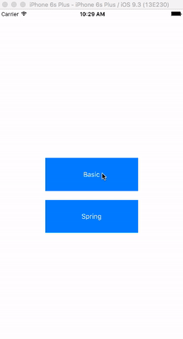
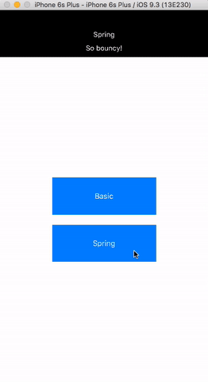

# DropdownAlert

[](http://cocoapods.org/pods/DropdownAlert)
[](http://cocoapods.org/pods/DropdownAlert)
[](http://cocoapods.org/pods/DropdownAlert)

A clean, customizable Swift alternative to [RKDropdownAlert](https://github.com/cwRichardKim/RKDropdownAlert).

## Overview

RKDropdownAlert is great. It's simple and easy to use. The developer is a great guy.
But...there are some problems.

First, it's written in Objective-C and any Swift developer will tell you the same thing:


Second, it's not responsive. To be truly responsive, any view library **should** be written using AutoLayout.

Finally, there's a huge caveat:

> WAIT! Don't use pods if you want to customize or use the quick and easy [RKDropdownAlert show]

Developers have come to expect the convenience of Cocoapods and if you can't both customize the dropdown and download it from Cocoapods, what's the point?

That's where `DropdownAlert` comes in. Weighing in at just under 300 lines, `DropdownAlert` is _sleek_, _fully customizable_, _responsive_, _Swift 2.3 compatible_, and powered by [Facebook's pop](https://github.com/facebook/pop) animation library, allowing for awesome custom animations.

## Usage

`DropdownAlert` comes with 3 animation types, `Basic`, `Spring`, and `Custom`:

```swift

/**
Animation types the dropdown can be presented with.

- Basic:  Basic, simple animation.
- Spring: Spring animation.
- Custom: Custom animation.
*/
public enum AnimationType {
    case Basic(timingFunction: CAMediaTimingFunction)
    case Spring(bounce: CGFloat, speed: CGFloat)
    case Custom(POPPropertyAnimation)
}
```

Simply call like so:

```swift
DropdownAlert.showWithAnimation(.Basic(timingFunction: CAMediaTimingFunction(name: kCAMediaTimingFunctionEaseIn)), title: "Login Failed", message: "Incorrect username/password", duration: 2)
```



You can stack as many animations as you want:



### Customization

Unlike `RKDropdownAlert`, `DropdownAlert` is fully customizable in conjunction with Cocoapods. The following class level properties are customizable:

```swift
class var defaultBackgroundColor: UIColor
class var defaultTextColor: UIColor 
class var defaultTitle: String
class var defaultMessage: String
class var defaultAnimationDuration: Double
class var defaultDuration: Double
class var defaultHeight: CGFloat
class var defaultTitleFont: UIFont
class var defaultMessageFont: UIFont
class var defaultFontSize: CGFloat
```

And because `DropdownAlert` internally uses Autolayout, the size of the alert will be always be greater than or equal to the default height + content overflow size, meaning your message can be as long as you want!

To customize a particular attribute:

```swift
DropdownAlert.defaultHeight = 110
DropdownAlert.defaultBackgroundColor = UIColor.blueColor()
```

## Support

Feel free to open an issue or issue a PR! Check out the [contribution guide](DropdownAlert/CHANGELOG.md) for more info.

## Example

To run the example project, clone the repo, and run `pod install` from the Example directory first.

## Installation

DropdownAlert is available through [CocoaPods](http://cocoapods.org). To install
it, simply add the following line to your Podfile:

```ruby
pod "DropdownAlert"
```

## Author

Brendan Conron, conronb@gmail.com.

[Twitter](https://twitter.com/startupthekid)

## License

DropdownAlert is available under the MIT license. See the LICENSE file for more info.
